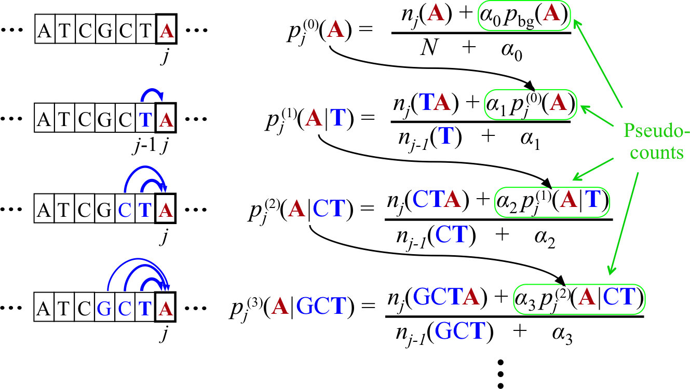

What is the BaMM webserver?
###########################

Bayesian Markov Models (BaMMs) have shown to outperform simple position weight matrices (PWMs) in learning regulatory motifs from next-generation sequencing data :cite:`siebert_soeding_2016`.

BaMM webserver is a web resource for discovery of regulatory motifs  with higher-order Bayesian Markov Models (BaMMs).

It supports four workflows for integrated Motif analyses:

  * Discovering higher-order motifs in a nucleotide sequence sets

  * Search sequences for motif occurrences

  * Browsing and text searching higher-order model databases

  * Comparing motifs to our higher-order databases

BaMM webserver is designed to make the power of higher-order motif analysis accessible in common motif analysis tasks. 

Understanding BaMMs
*******************

Higher-order Markov models are by no means an invention of the Soedinglab.
The theory is in the literature for almost as long as PWMs.
However higher-order models have a huge disadvantage: The number of parameters increases exponentially with the order of the model.
This makes it difficult to train these models robustly with limited data.

BaMMs introduce a novel choice of the regularization for preventing overfitting. They are constructed in a way that lower orders act as priors on higher orders.
This way higher-order parameters are pruned if not supported by enough evidence.

The details are described in the following scheme.

Bayesian Markov model training automatically adapts the effective number of parameters to the amount of data.

In the last line, if the context GCT is so frequent at position j in the motif that its number of occurrences
outweighs the pseudo-count strength, :math:`n_j(GCT) \gg \alpha_3`, the third-order probabilities for this context
will be roughly the maximum likelihood estimate, e.g. :math:`p_j(A|GCT) ≈ n_j(GCTA)/n_{j−1}(GCT)`.

However, if few GCT were observed in comparison with the pseudo-counts, :math:`n_j(GCT) \ll \alpha_3` , the third-order probabilities
will fall back on the second-order estimate, :math:`p_j(A|GCT) \approx p_j(A|CT)`. If also :math:`n_j(CT) \ll \alpha_2`,
then likewise the second-order estimate will fall back on the first-order estimate, and hence
:math:`p_j(A|GCT) \approx p_j(A|T)`.

In this way, higher-order dependencies are only learned for the fraction of
k-mer contexts that occur sufficiently often at one position j in the motif’s training instances to trump the
pseudo-counts. Throughout this work we set :math:`\alpha_0 = 1` and :math:`\alpha_k = 20 × 3^k − 1`.
