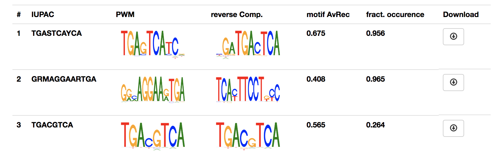
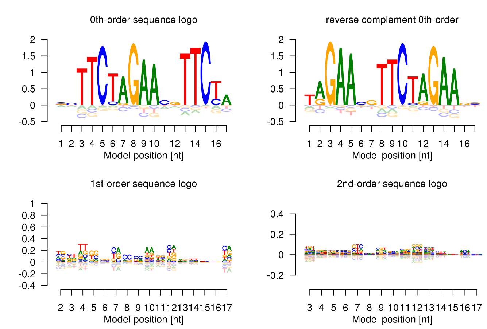
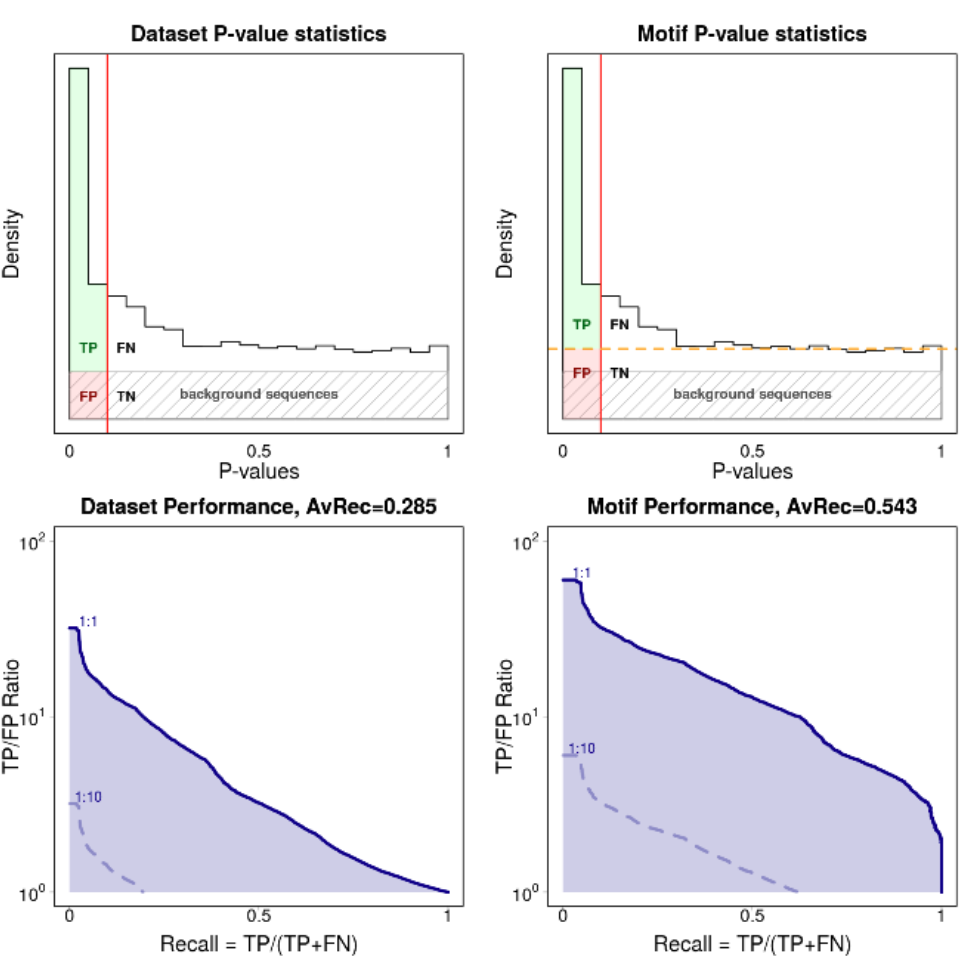
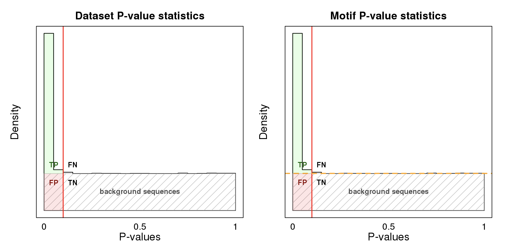
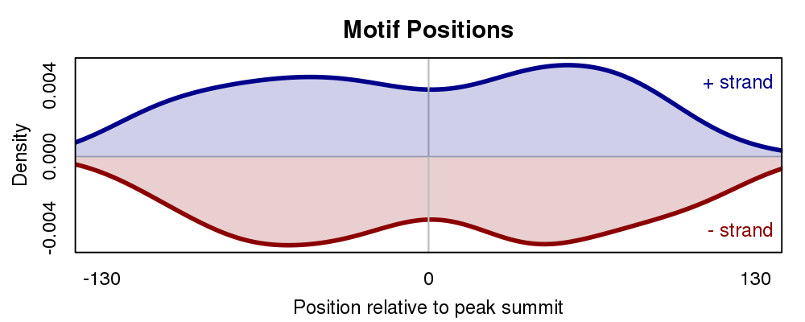

Understanding the output
########################

The BaMM webserver offers a wide variety of analyzes and plots. In this section we try describe in detail what they show and how it can be used and interpreted in your own analysis.

Motif overview
**************

The result start with an overview table of the motifs.

For each motif, it shows the IUPAC sequence, the 0th order motif representation (PWM) and if available the estimated performance of the motif and fraction of sequence that contain the motif.

The motif and all analyzes can be downloaded by clicking the button in the last column.

Sequence logos
**************

We developed sequence logos for higher orders to visualise the BaMMs. 

For this we split the relative entropy

.. math::
        H(p_{motif}|p_{bg}) = \sum_{x}^{}{ p_{motif}(x) log_2[ p_{motif}(x) / p_{bg}(x)]}
        
into a sum of terms, one
for each order. The logos show the amount of information contributed by each order over and above what is provided by
lower orders, for each kmer and position.

In the 0th-order sequence logo, the height of the four bases on each column is determined by their relative frequencies.
More frequent bases are depicted on top of less frequent bases. Consequently, the consensus sequence can be assembled
from the top bases, while the vertical order of bases in each column corresponds to their order of predominance.

This 0th-order sequence logo was designed to reflect the characteristics of the PWM model and has been widely used.
However, it is not suited to illustrate dependencies between binding site positions. 

We therefore also provide higher-order logos. In the higher-order logos, the height of both columns and *k*-mers corresponds to the contribution to the
information content that is not yet described in a lower order, in other words, the information you can gain by taking
into consideration of the dependencies between positions in the motif. Note that *k*-mers can exhibit negative
contributions to the information content.

.. _results_avrec:

AvRec evaluation
****************

Why yet another evaluation metric?
==================================

Various metrics are used for describing the quality of a motif, most noteably p-values, Area Under the Receiver Operating Characteristic curve (AUROC), Area Under the Precision Recall curve (AUPRC).
All of these methods have problems capturing the potential biological relevance of the motif. For a more detailed explanation, please refer to :cite:`kiesel2018bammserver`.

We sought to develop a motif performance evaluation that

  #. covers the range of False discovery rates (FDR) most relevant in practical applications
  #. allows the user to easily estimate the performance of the motif in her particular application

The method
==========
We generate background sequences from a second-order Markov model trained on all input sequences and evaluate how well the motif separates positive sequences from the negative (=background) sequences.
We define true positives (TP) as correct predictions, false positives (FP) as false predictions, and false negatives (FN) as positive test cases that have not been predicted.
The precision is defined as the fraction of predictions that are correct, TP/(TP+FP), and the recall (= sensitivity) is the fraction of true motif instances that
are actually predicted, TP/(TP+FN).

The TP/FP ratio is calculated for a positives:negative ratio of 1:1. We plot the recall-TP/FP ratio curve, with TP/FP ratio plotted on a logarithmic y-scale, (between 1 and 100)

The area under this curve is the average recall (AvRec) in the regime of relevant FDR values.

Dataset AvRec vs. motif AvRec
=============================
We give two different version of the AvRec score. The **dataset AvRec** and the **motif AvRec**. For the dataset AvRec we assume that all sequences of the input set are positive, meaning that all of them are bound.
If only a fraction of the sequences carry the motif the dataset AvRec will severely underestimate the motif performance as unbound sequences will behave as the background sequences.

For the **motif AvRec** we estimate the number of sequences carrying the motif with the fdrtool :cite:`strimmer2008fdrtool`. By this strategy, we label as positive only the sequences that carry a motif.

Dataset AvRec and motif AvRec have the same value if all sequences are estimated to carry a motif. 

The performance plots
=====================

We show four performance plots: the distribution of p-values calculated under the ZOOPS model and its respective recall vs. TP/FP ratio curve for the dataset AvRec (left column) and the motif AvRec (right column).

P-value distribution plots
--------------------------

The p-values are calculated on the joint set of background sequences and input sequences. The p-value is calibrated such that it is uniform over the background sequences (shown as a gray shaded rectangle).
The input sequences will carry the motif more often than random and therefore enrich for low p-values.
Input sequences that do not carry a motif have uniformly distributed p-values.

For the motif AvRec analysis the p-value distribution plot also contains an orange dashed line that separates the sequences with motif (above the line) from sequences without motif (below the line).
If all input sequences carry the motif the orange line will coincide with the fraction of positive sequences, shown here:

As described above, in this case the dataset AvRec is equal to the motif AvRec.

Recall vs. TP/FP ratio plots
----------------------------

The recall vs. TP/FP ratio plots are calculated from the p-value distribution plots. The TP/FP ratio axis is depicted in logscale, ranging from 1 to 100. The TP/FP ratio :math:`R` is directly related to the FDR via 

.. math::

  \text{FDR} = 1 / (1 + R)

The highest point on the y axis (R=100) therefore relates to an FDR of 1/101, the lowest to an FDR of 0.5.

We generate three blue lines for different ratios of positive to negative ratios.
The solid blue line represents the same number of positive and negative sequences (ratio 1:1).
We also draw two dashed lines for the ratios 1:10 and 1:100.
Note that depending on the motif quality not all of the lines may be visible.

We define the AvRec score as the area under the solid curve (1:1) case. It is also given at the top of the plot.

**Note:** in the recall vs. TP/FP ratio plot, the line representing positive/negative ratio of 1:10 is the 1:1 curve shifted down by one unit (:math:`\log_{10}(10) = 1`).
This allows to estimate the motif performance for your own exected ratio of positive to negatives.
All you have to do is shifting the 1:1 curve according accordingly!

Motif distribution plot
***********************

The motif distribution plot shows the distribution of motif occurences over the input sequences relative to the middle of the sequences.

In a ChIP-seq experiment primary motifs should have a higher enrichment around the middle of the sequence. Factors of co-binding motifs often show a less clear positional preference.

The plot can be influenced by varying the ``Motif scan p-value cut-off``.
When setting to a low p-value, only highly significant motif positions are used for generating this plot.

Motif-motif comparison
**********************

Workflows that use Motif-motif compare to annotate motifs with a collection of motifs in our database will produce a result similar to this.

.. image:: img/mmcompare_annotation.png
  :width: 600px
  :align: center

The results are sorted by significance, given by the e-value score.
The e-value is the expected number of hits when searching a scrambeled motif against the database.

The button in the last column can be used to find detailed information for the motif in our database. From there the motif can be used to scan your sequences for occurences.

