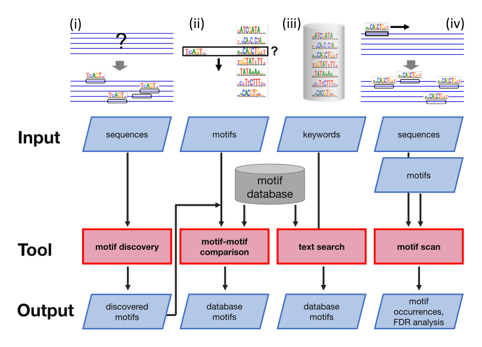
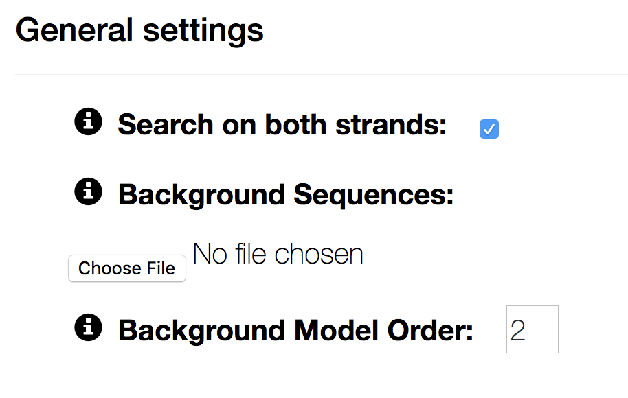
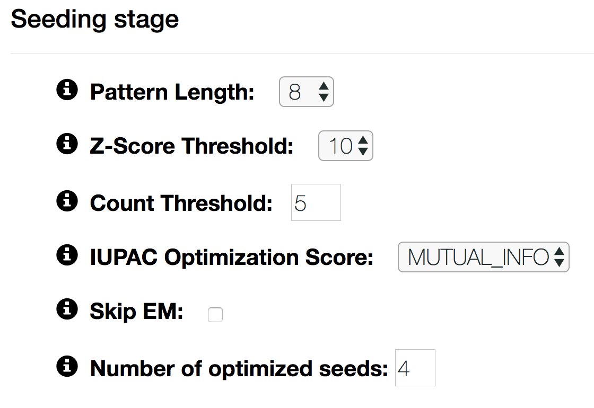
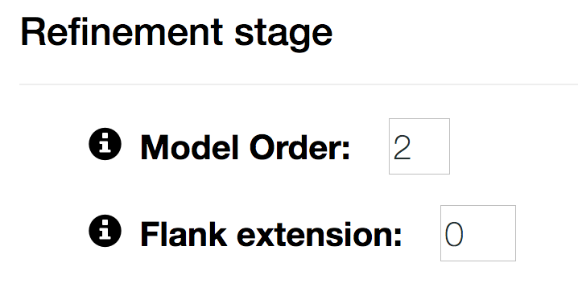
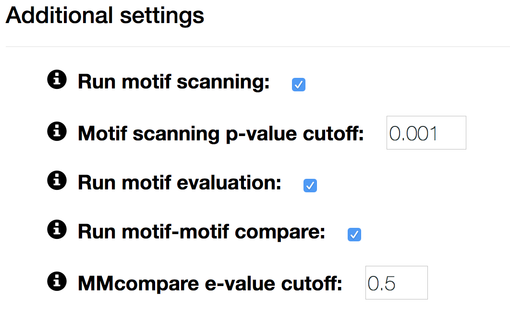
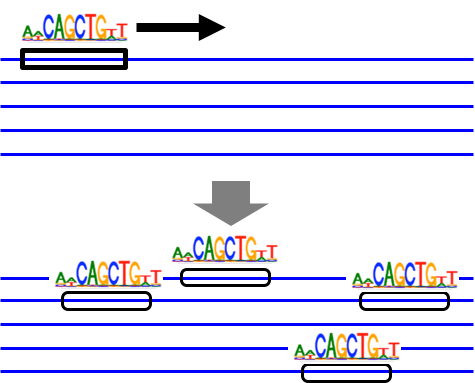

Available workflows
###################

The BaMM webserver offers four workflows for analyzing regulatory motifs. In the following the worflows are described in detail.

   BaMM webserver workflows

   A schematic of the four workflows available at the BaMM webserver: (i) De-novo motif discovery, (ii) Motif-motif compare, (iii) Motif database search, (iv) Motif scan.

De-novo motif discovery
***********************

.. image:: img/denovo_icon.png
  :width: 200px
  :align: center

For our higher-order BaMM models, de-novo motif discovery takes place in two stages: seeding and motif refinement.
In the seeding stage, we use PEnG-motif, a very fast algorithm for finding enriched IUPAC base patterns which we optimize to seed PWMs.
In the refinement stage, the PWM seeds are then optimized to higher-order BaMMs.

The default de-novo workflow hides the seeding phase from the user. The best-performing seeds are automatically selected for higher-order refinement.
We also offer a second, slightly more complex workflow, that reports possible seed PWMs and lets the user choose seeds for refinement. You can access it by clicking following button on the bottom of the de-novo motif discovery workflow:

  

.. _usage_section:

Usage
=====

In its simplest form, the de-novo motif discovery workflow requires a fasta file with sequences and reports up to four higher-order models.

By clicking on the ``Advanced 0ptions``, the user can choose a wide variety of additional settings and parameters organized into four subgroups: general settings, seeding stage, refinement stage and settings for further analyses.

General settings
----------------

Search on both strands
        if unchecked, motifs can not lie on the reverse complemented strand. Searching on the PLUS strand only can be useful for stranded data, such as RNA.

Background Sequences
        by default the background model is learnt as a homogeneous Markov model on the input sequences. If you have a separate negative set, you can upload it as a fasta file here.

Background Model Order
        sets the order of the background model. The higher the background order, the more realistic the background model. We recommend order 2 for ChIP-seq data. For very short motifs (e.g.) RNA binding motifs, order of 1 or 0 may be necessary to detect the motif.

Seeding stage
-------------

Pattern Length
        The length W of patterns on the sequences to be searched.

Z-Score Threshold
        Only W-mers which surpass this z-score threshold will be considered for seed optimization.

Count Threshold
        Only W-mers that surpass this count threshold will be considered for seed optimization.

IUPAC Optimization Score
        Scoring function that is optimized in IUPAC pattern generation. Currently there are three options:

        * LOGPVAL: optimize to IUPAC pattern with the lowest p-value
        * MUTUAL_INFO: optimize to IUPAC pattern that has the highest mutual information between presence of a motif and being a positive sequence
        * ENRICHMENT: optimize to IUPAC pattern with the highest enrichment over negative sequences

Skip EM
        When unchecked, the seeds are not optimized with the Expectation-Maximization (EM) algorithm.

Number of optimized seeds
        Up to this amount of seeds are refined to higher-order models.
        
  
Refinement stage
----------------

Model Order
        order of the Markov model. Models with high orders are more time consuming to train.

Flank extension
        extend the core seed by extra positions to the left and the right. Can be used to learn weakly informative flanking regions.

Settings for further analyses
-----------------------------

Run motif scanning
        uncheck to skip scanning the input sequences for motif occurrences.

Motif scanning p-value cutoff
        p-value cut-off for calling a position a binding site.

Run motif evaluation
        uncheck to skip motif performance evaluation.

Run motif-motif compare
        uncheck to skip motif annotation with models from one of our databases

MMcompare e-value cutoff
        e-value cutoff for reporting motif-motif matches with our motif database

Motif scan
**********

Motif scan takes a motif and a set of sequences and predicts binding positions of the motif.
The uploaded motif can be either in `MEME-format <http://meme-suite.org/doc/meme-format.html>`_ (>= version 4) or in BaMM format.

When scanning with a BaMM motif two files are required: A BaMM model (extension ``*.ihbcp``) and its corresponding background frequencies (extension ``*.hbpc``).

By default the performance of the motifs on the input set is evaluated. Optionally the motifs can also be annotated with one of our motif databases.

Please refer to :ref:`usage_section` for a detailed description of the advanced parameter settings.

Motif database
**************

.. image:: img/database_icon.png
  :width: 100px
  :align: center

Our motif databases consists of over 1000 4th-order BaMM, trained on ChIP-seq peaks collected by the `GTRD project <http://gtrd.biouml.org/>`_ :cite:`yevshin2016gtrd`.

The BaMMs fall into following sub-collections:

* 613 motif models for ``Homo sapiens`` (human)
* 354 motif models for ``Mus musculus`` (mouse)
* 19 motif models for ``Rattus norvegicus`` (rat)
* 16 motif models for ``Danio rerio`` (zebrafish)
* 34 motif models for ``Schizosaccharomyces pombe`` (yeast)

.. warning:: Please be aware that the BaMM databases are automatically generated. While comparison against manually curated databases showed that they are generally of high quality, sometimes we also learn co-factors or a combination of protein-of-interest and cofactors.

For users relying on accurate motif annotation we also offer the manually curated PWM databases JASPAR Core :cite:`khan2017jaspar` and HOCOMOCO :cite:`hocomoco_2018`.

Motif-motif comparison
**********************

.. image:: img/compare_icon.png
  :width: 200px
  :align: center

The motif-motif comparison tool allows to search with a motif in MEME or BaMM format against a motif subcollection of our database. The e-value is the only configurable parameter.
